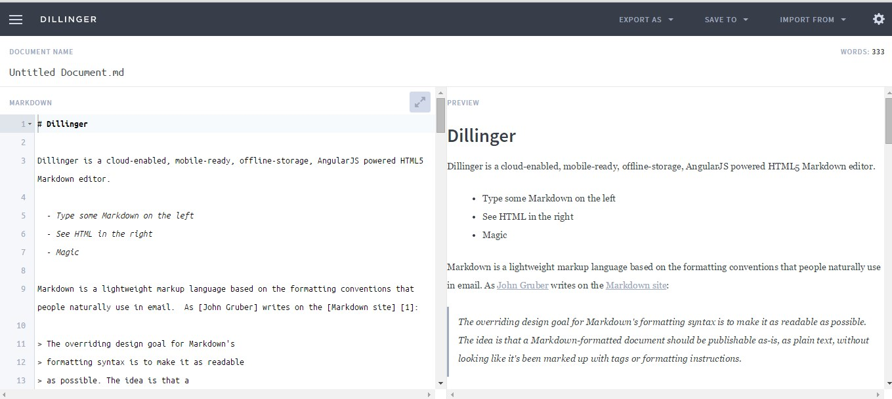
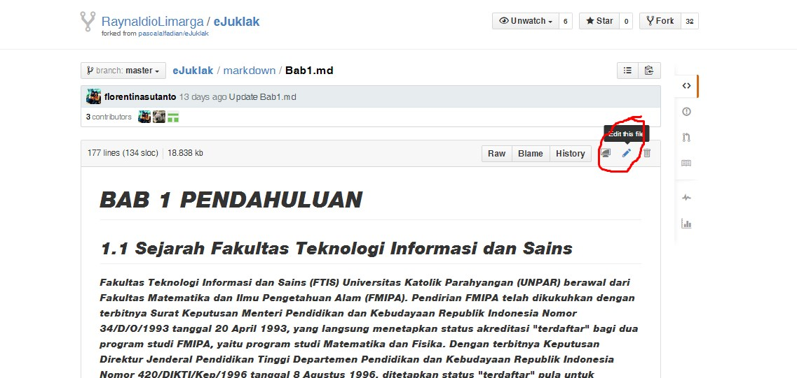

# Penjelasan Cara Membuat Aplikasi dari Source Code

##Persiapan Markdown

Buat file-file markdown dengan menggunakan aplikasi dari [web dillinger](http://dillinger.io "Web Dillinger) agar tampilan dari kode markdown dapat langsung terlihat

Jika ada beberapa kesalahan, editor bisa langsung mengubah kode markdown dari github.

Setelah semua file markdown final, file-file markdown perlu dikonversi menjadi file-file html. Konversi file markdown menjadi html dilakukan dengan menggunakan aplikasi pandoc. Aplikasi pandoc dapat diakses melalui command prompt (cmd).
