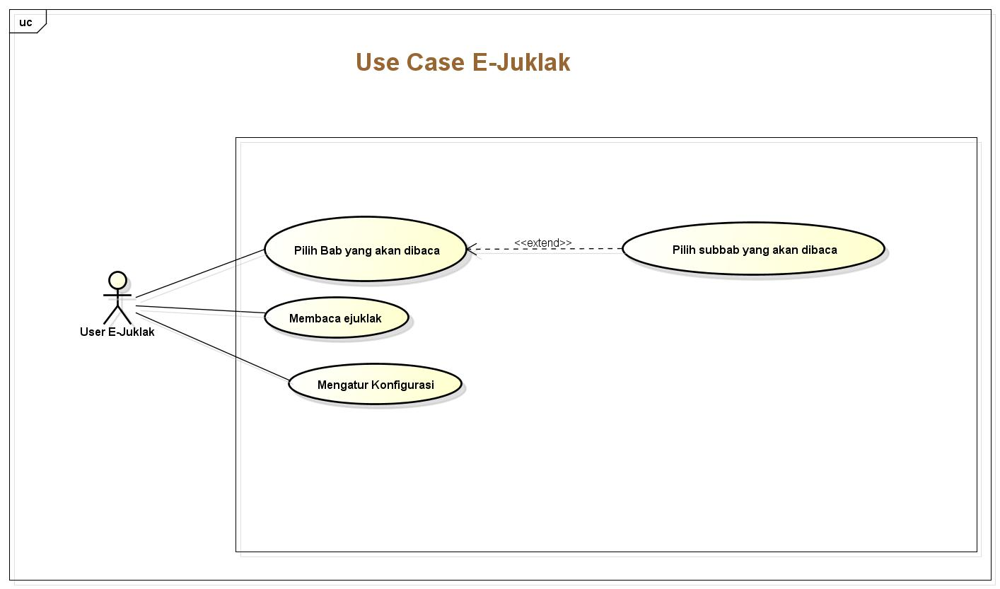
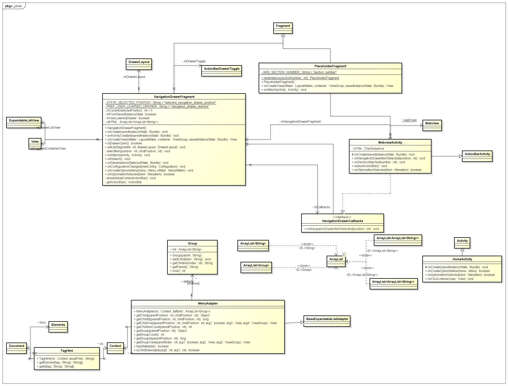

__Cara Menggunakan Aplikasi__

1. Buka aplikasi E-juklak

  

2. Ketika aplikasi E-Juklak di buka akan muncul halaman awal dari E-Juklak.

  

  Pada halaman awal ini terdapat 3 fitur yaitu:
  - Fitur Read: fitur ini berfungsi untuk membaca isi dari juklak yang telah dikonversikan ke dalam bentuk html. Bila tombol read di klik, pengguna akan diarahkan pada halaman isi yang berfungsi untuk menampilkan isi dari dokumen juklak. Pada halaman ini juga terdapat fitur navigasi yang ditandai dengan lingkaran berwarna merah.

    

    Apabila tombol navigasi ini di tekan, maka user dapat melihat isi dari Bab dan sub-bab yang ada.

    

    User dapat berpindah ke halaman yang dituju dengan menekan salah satu dari bab ataupun sub-bab yang ada. Sebagai contoh apabila user menekan sub-bab 3.1 seperti yang diperlihatkan pada gambar di bawah ini:

    

    Maka halaman isi akan berpindah sesuai dengan bab ataupun sub-bab yang telah dipilih.

    

  - Fitur Settings: fitur ini memiliki fungsi untuk mengatur ukuran dari teks yang akan dipergunakan. Terdapat 3 ukuran untuk mengatur ukuran teks yaitu small, medium dan big.

    

    User juga bisa mengubah mode untuk membaca dengan mengaktifkan fitur night mode. Hasil perubahan yang telah dilakukan disimpan dengan menekan tombol save, sehingga perubahan pada ukuran teks dan mode baca dapat dilihat pada gambar di bawah ini.

    

  - Fitur About us: fitur ini berfungsi untuk menampilkan informasi tentang pihak-pihak yang terlibat dalam pembuatan aplikasi E-Juklak.

    

__Cara mem-build aplikasi dari source code yang ada di repositori__

__Struktur program__

