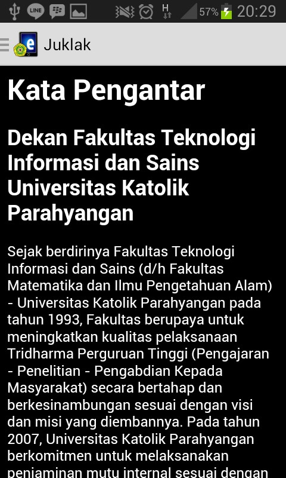

#DOKUMENTASI

##Cara Menggunakan Aplikasi

1. Buka aplikasi E-juklak

  

2. Ketika aplikasi E-Juklak di buka akan muncul halaman awal dari E-Juklak.

  

  Pada halaman awal ini terdapat 3 fitur yaitu:
  - Fitur Read: fitur ini berfungsi untuk membaca isi dari juklak yang telah dikonversikan ke dalam bentuk html. Bila tombol read di klik, pengguna akan diarahkan pada halaman isi yang berfungsi untuk menampilkan isi dari dokumen juklak. Pada halaman ini juga terdapat fitur navigasi yang ditandai dengan lingkaran berwarna merah.

    

    Apabila tombol navigasi ini di tekan, maka user dapat melihat isi dari Bab dan sub-bab yang ada.

    

    User dapat berpindah ke halaman yang dituju dengan menekan salah satu dari bab ataupun sub-bab yang ada. Sebagai contoh apabila user menekan sub-bab 3.1 seperti yang diperlihatkan pada gambar di bawah ini.

    

    Maka halaman isi akan berpindah sesuai dengan bab ataupun sub-bab yang telah dipilih.

    

  - Fitur Settings: fitur ini memiliki fungsi untuk mengatur ukuran dari teks yang akan dipergunakan. Terdapat 3 ukuran untuk mengatur ukuran teks yaitu small, medium, dan big.

    

    User juga bisa mengubah mode untuk membaca dengan mengaktifkan fitur night mode. Hasil perubahan yang telah dilakukan disimpan dengan menekan tombol save, sehingga perubahan pada ukuran teks dan mode baca dapat dilihat pada gambar di bawah ini.

    

  - Fitur About us: fitur ini berfungsi untuk menampilkan informasi tentang pihak-pihak yang terlibat dalam pembuatan aplikasi E-Juklak.

    

##Cara mem-build aplikasi dari source code yang ada di repositori

- Persiapan Markdown
  Buat file-file markdown dengan menggunakan aplikasi dari [Dillinger](http://dillinger.io/) agar tampilan dari kode markdown dapat langsung terlihat

  

  Jika ada beberapa kesalahan, editor bisa langsung mengubah kode markdown dari github.

  

  Setelah semua file markdown final, file-file markdown perlu dikonversi menjadi file-file html. Konversi file markdown menjadi html dilakukan dengan menggunakan aplikasi pandoc. Aplikasi pandoc dapat diakses melalui command prompt (cmd).
  
- Build .apk dari source code
  - Buka file E-Juklak yang terdapat di GitHub dengan IDE yang mendukung Android (Eclipse, Andorid Studio, etc).

  - Ganti HTML yang terdapat di E-Juklak/assets dengan html yang diinginkan (format penulisan html harus sama persis dengan format penulisan html hasil convert oleh pandoc).

  - Nama file html yang akan diganti harus sama persis dengan nama tiap file saat ini (bab1.html, bab2.html, etc).

  - Export project tersebut untuk mendapatkan .apk dari aplikasi tersebut.

  - Aplikasi dapat berjalan di semua device Android.

##Struktur program

- Usecase Diagram

  

- Class Diagram

  
  
  Penjelasan tiap kelas:
  - AboutUs: Kelas yang merepresentasikan About Us.
  - Group: Kelas yang merepresentasikan sebuah bab dan sub-bab.
  - HomeActivity: Kelas yang merepresentasikan menu utama.
  - MenuAdapter: Kelas untuk menyimpan konten dari setiap bab dan subab.
  - NavigationDrawerFragment: Kelas yang merepresentasikan sidebar menu.
  - Persistence: Kelas untuk menyimpan variabel global yang digunakan oleh kelas Settings.
  - Settings: Kelas yang merepresentasikan pengaturan aplikasi.
  - TagHtml: Kelas untuk mengolah file HTML.
  - WebviewActivity: Kelas yang digunakan untuk membaca file HTML dan ditampilkan pada layar.

- Sequence Diagram

  
  
  https://cloud.githubusercontent.com/assets/10735996/7601760/113a3db6-f945-11e4-8570-74450c16ad9e.jpg

